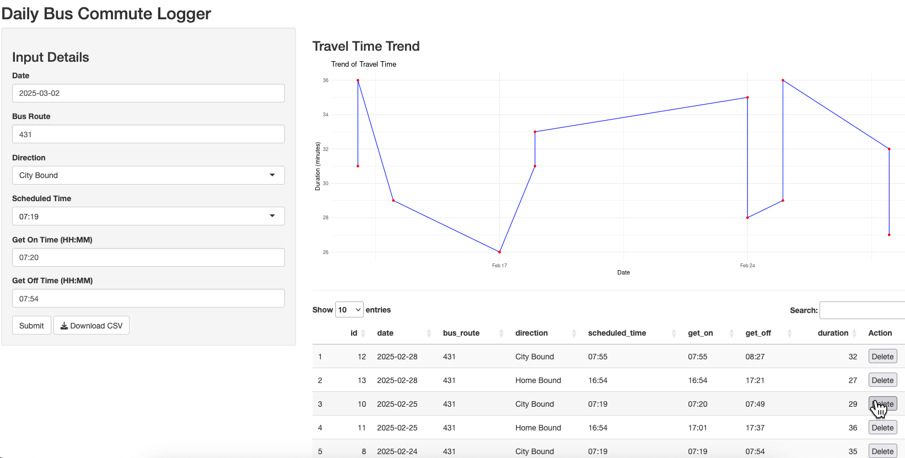

# bus_time_logger
My first shiny app to do a time looger on my bus commute. I am very interested to capture my commute travel time from Brisbane Western Suburb to CBD, hence did this shiny dashboard to streamline my process of logging plus visualisation.

# Functionality
This is mainly to log get on/off time for specific bus route, and whether it's city bound or home bound.In the backend, travel time was calculated then inserted into the sqlite db. In the meantime, also have the function to delete unwanted records and download data as csv.

# Dashboard
The dashboard is hosted on [here](https://wilsonyung.shinyapps.io/bus_time_logger/) on shinyapps.io, I was also exploring other option like using docker to host on my own NAS.

